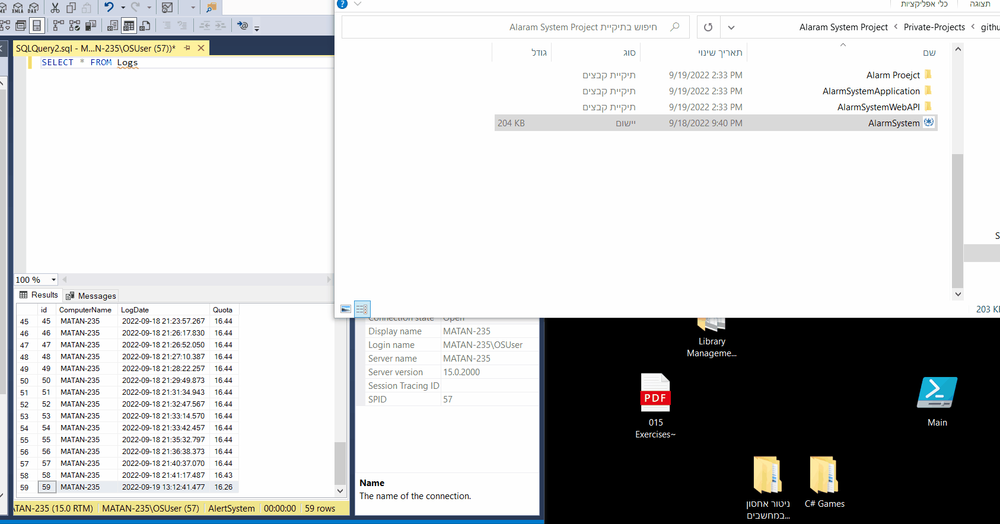

# Alarm System Project 

Client-Side: Powershell GUI  
Back-End: C# Net Core Web API  
Database: SQL Server

<h2>Info</h2>
The Alarm.exe check for your quota, if it is less than 20GB - it's open a pop-up and let you exit from it or contact the administrator.  
If you click contact, it's send your data With WEB API "Post" Method to the Back-End and the Back-End send it to the Database.
    

