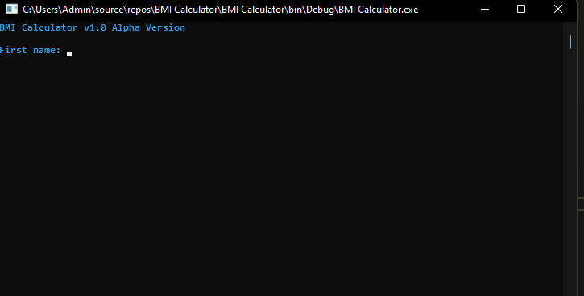

1.	Ask the user for their Mass (kg) and height (m). height should be squared (height^2) 
2.	Create a Class for calculate Mass divided (/) by the height^2 and return the number.
3.	If less than 16 = Severe Thinness, between 16-17 Moderate Thinness, 17-18.5 Mild Thinness, 18.5-25 is normal, 25-30 is overweight and tell the person he should consult a doctor.

