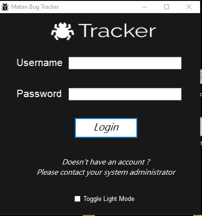
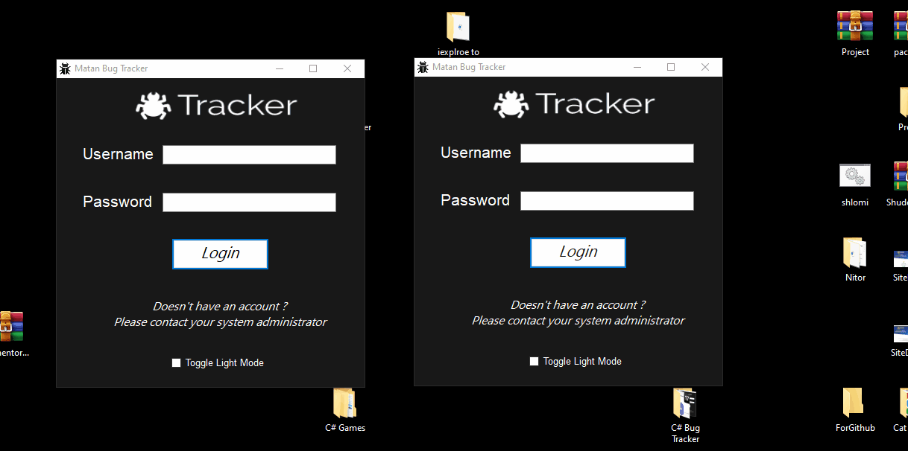
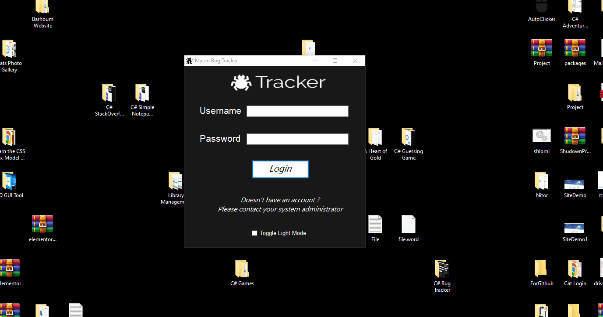
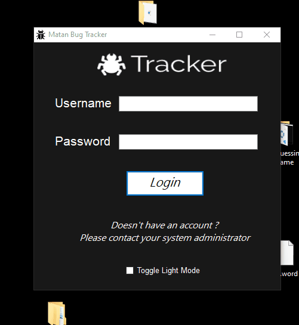
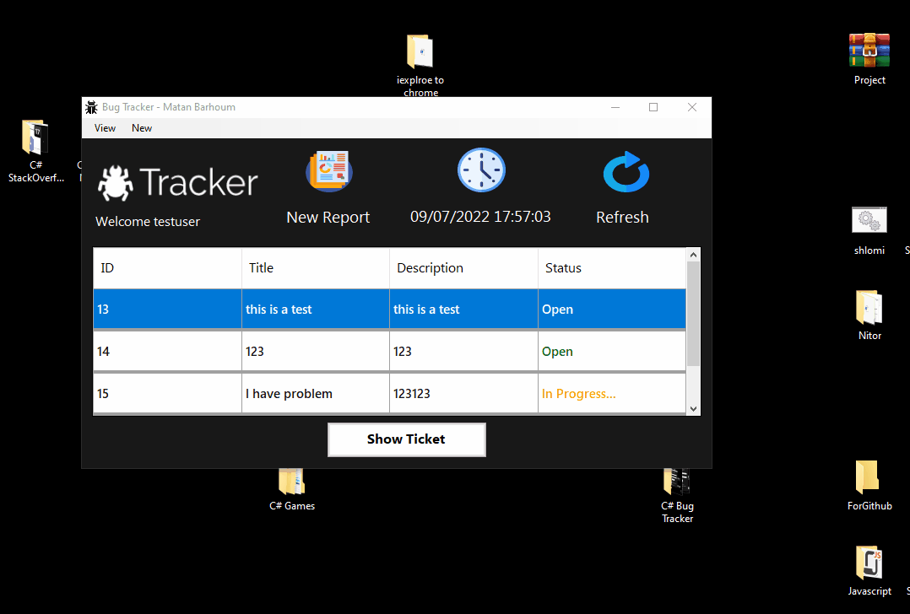
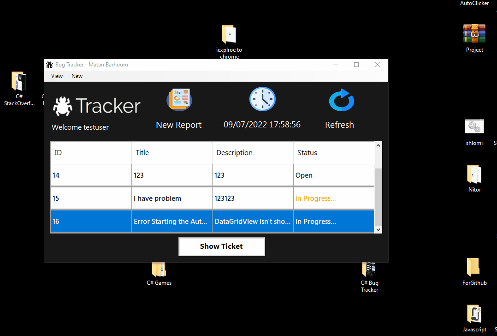
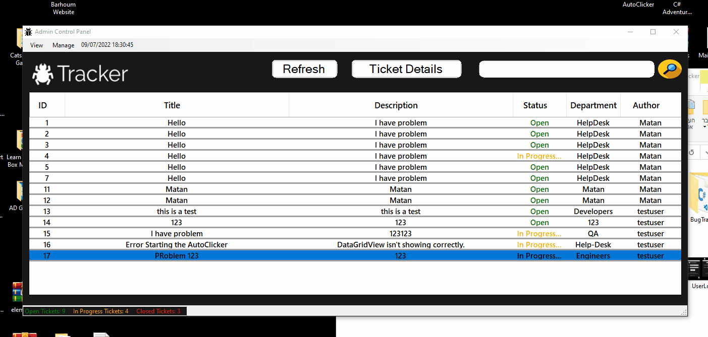
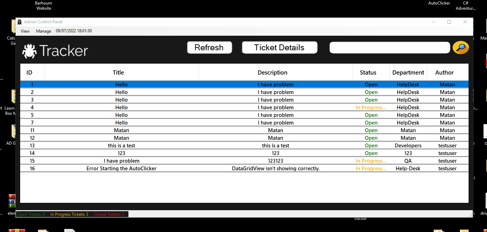
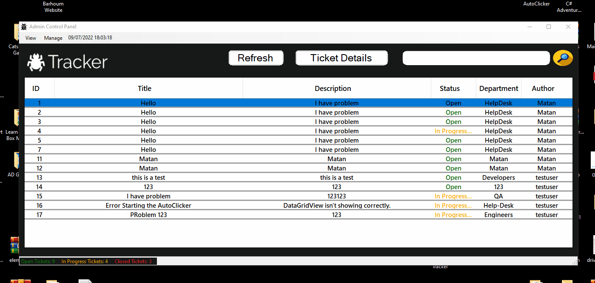

# C# Bug Tracker Project

<h1>Functions:</h1>
<h2>Light\Dark Mode Switch</h2>

<h2>User Login</h2>

<h2>Admin Login</h2>

<h2>SQL Authnetication</h2>

<h2>User Form</h2>

<h2>User New Report</h2>

<h2>User See Answer From Admin</h2>

<h2>Admin Form</h2>

<h2>Admin Form Filter</h2>

