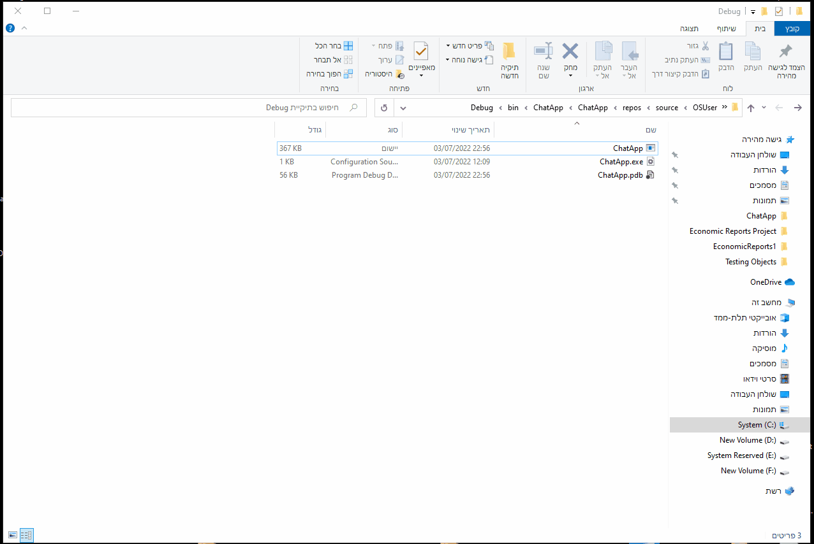

# C# Chat Application with DB + login \ register
Chatty App has been developed as a way to communicate within a intranet (Without an internet connection). Then, We can use it like a whatsapp in work and talk.  
This is mainly because we barely touch the phone, and as a funny joke between friends at work. :)  
Use it as you like, Code as code, App as App (exe in the debug/bin folder). 

<h1>Demonstration</h1>
<h2>How the app works</h2>

<h2>Register</h2>

<h1>To DO:</h1>
<ol>
  <li>Bind a static port \ Button to generate a random port</li>
  <li>Colors for receiver \ sender</li>
  <li>Profile photo + Profile Panel</li>
  <li>Db Column for nickname</li>
  <li>Emoji, Images, Files transfer !!!</li>  
</ol>
