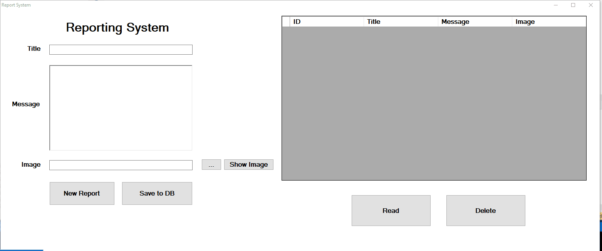

# C# Report System With Database

 
After doing my first Database project, and doing the same project without database (with datagridview, which was deleting all the data after the program was closed)
 
I've worked to make the same Reporting System, in which we can insert the report nubmer, a message and even a image with load function. 
 
Everything is saved to the database (using sql server 19), and can be accessed.
 
This project helped me to learn alot about the SQL Commands and how to execute, and how to perfome SQL tasks with GUI forms.
 
For example - to delete a varchar (string) from SQL we need to use 'string' and not string. Using \' + string + '\ I overcome the problem that the string was without quotation marks.
 
This project can be translated into full working projects for a lot of projects, small companies and even bigger ones.
 
# Changes 
1. After the user press the "Delete" button, the Text boxes are cleared and return to be blank for another use and fill. this can be also be done with the "New" button.
