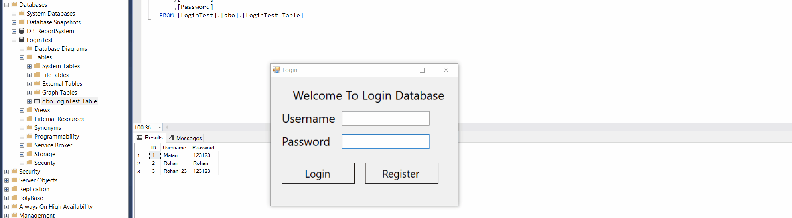

# C# Simple Login&Register With Database

 
Simple C# project to demonstrate my understanding in SQL in C#. After my last project, "Report System with Database", I learned how to create a system to login and register with SQL queries and how to read them using reader.
 
The reader gets the info from the Textboxes, and if they are correct, reader increase his "rows" value. if the "Reader" has rows (they are correct and equal what in the database) a connection establish.
 
This is the first step into making a large program which include login for a dashboard forwarding.
 
Todo:
 
1. I should understand how to avoid SQL Injections using parameters @username, @password and then add their value.
 
2. I should implement a Sha-1 / Sha-512 Encryption to store the passwords safely on the database.

