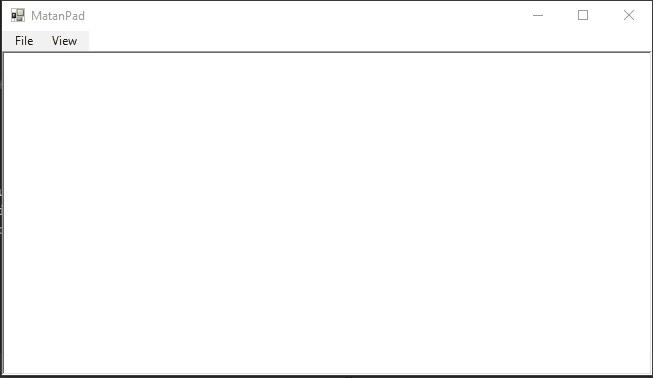

# C# Simple NotePad GUI-Project

Simple notepad project is a project that simulate a simple notepad that have the "Save, Open, New" and "Font" Menu functions.
In this project I used the "System.IO" for manipulating files. I also used the SaveFileDialog, OpenFileDialog and FontDialog classes.

This project has been made to show people how Notepad working from the backside and to demonstrate my knowledge so far in C#.

Best Regards,
Matan Barhoum.
