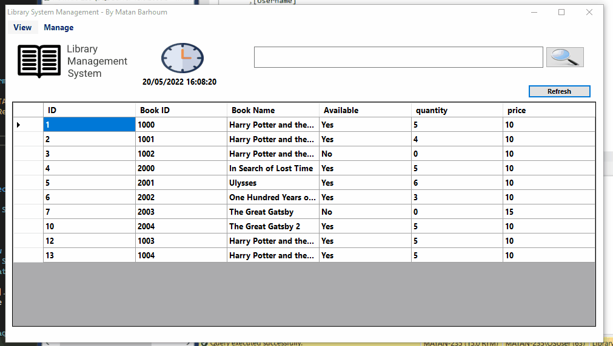

# C# Library Management System 

A Project i've been working on since yesterday. This system can help library workers to manage their books, see which books available (By category, name).
 
This project helped me understand greatly how to implement DB system into a C#. Update, Insert, Delete, Select and SQL Datatypes. SqlAdapter, ExecutreReader to authenticate values infornt the DB. 
In this project I understood greatly the diffrences between Show and ShowDialog. With Show() method I can navigat other forms windows and use them only to read data.
 
A Search engine with DB - This was fun! using the DB Select command, I can search using the Select Command with "like" and "% %" in condition. 
 
This is an incomplete project.
 
<b> To do: </b>
1. Complete Books by category (Select * from (Table) Where category = @category) for each category.
 
2.Some Category needs to be reshaped to hide columns the worker do not need to see but exist to filter the results. Using SqlDataAdapter and DataSet, we declare a 
variable for table, and SqlDataAdapter.Fill(Table). Then, we call the talbe variable and use it methods.  For this request, we need to manipulate Table.Columns.Remove("Column Name").
 
3. New User UI for worker, can be copy-cat from Register.cs into a new UI. Same system, using the same table, columns and command.
 
4. Design - The most important thing. I like to code, not to design UX/UI. and as such, I don't care much about the design but about the tasks behind.
 

<h1> Examples </h1>
Gifs to show the work.
 
 
<h1> Register </h1>

<h1> Login </h1>
The Login system. Using ExecuteReader I check for the username and password to Authenticate with SQL.

<h1> Main Dashboard </h1>
Main Dashboard. Using getdate.now for time, search option to look over DB and print results in the datagridview.

<h1> New Book </h1>
a UI to add a book. using if statements checking for string.isnullorempty to check if nothing provided. if so, a messagebox appear and warn. 
Reader to check for duplicate Book Name or Book ID!!

<h1> New Renter </h1>
A search engine to search for users to get data like ID, Full name, email to help fill the form.
Reader to check if Book is exist in order to not register a book that don't exist.

<h1> View Rented Books </h1>
Library workers can see the rented books.

<h1> View Customers </h1>
Library workers can see the Customers with filter (Without Password, username, id..), Table.Columns.Remove was used to filter the DataGridView.

